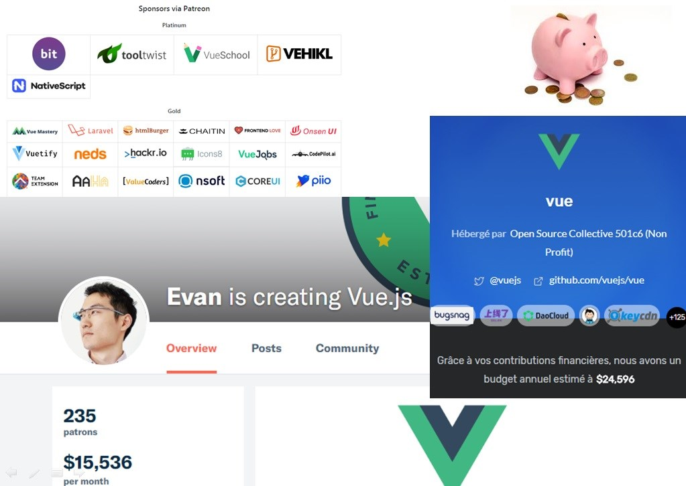
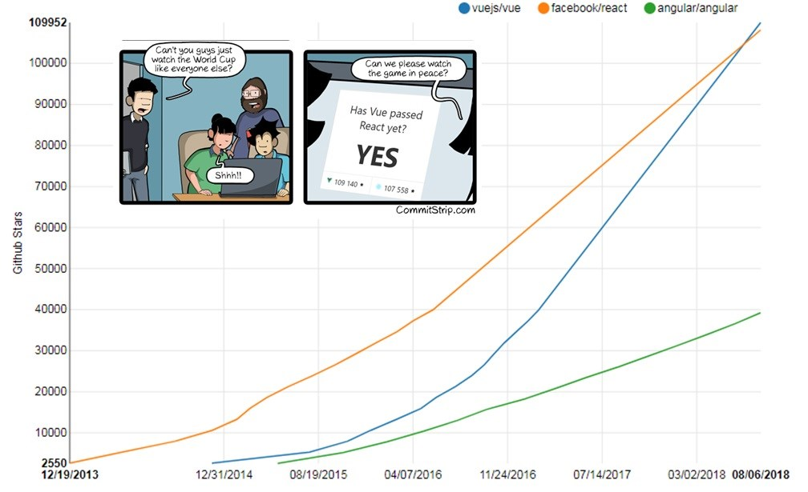

# Présentation de Vue.js

## Qu'est-ce que Vue.js ?

Vue *(prononcé /vjuː/, comme le terme anglais view)* est un framework évolutif pour construire des interfaces utilisateurs. À la différence des autres frameworks monolithiques, Vue a été conçu et pensé pour pouvoir être adopté de manière incrémentale. Le cœur de la bibliothèque est concentré uniquement sur la partie vue, et il est vraiment simple de l’intégrer avec d’autres bibliothèques ou projets existants. D’un autre côté, Vue est tout à fait capable de faire tourner des applications web monopages quand il est couplé avec des outils modernes et des bibliothèques complémentaires.

## Historique
Vue.js a été créé à l'origine par une seule personne, Evan You, ancien ingénieur de Google ayant notamment travaillé avec Angular.js puis sur le framework Meteor. Après avoir expérimenté une mécanique de réactivité qu'il jugeait plus intéressante que celle d'Angular, il décide de publier ses premiers résultats en juillet 2013. Cinq ans plus tard, Vue.js est le 3ème projet sur Github en nombre de stars et Evan enchaîne les conférences à travers le monde.

## L'équipe de développement
Vue dispose aujourd'hui d'une équipe internationale d'une trentaine de personnes, constituée de contributeurs bénévoles qui se sont formés avec les années. La décentralisation complète de l'équipe est à la fois une contrainte et une force qui lui a permis de diffuser le framework beaucoup plus rapidement à plusieurs endroits à la fois. On peut ainsi trouver facilement un contributeur Vue.js pas loin de chez soi, par exemple Guillaume Chau alias [Akryum](https://twitter.com/akryum) à Lyon. Cela permet aussi d'avoir du support rapidement peu importe le fuseau horaire.

[https://vuejs.org/v2/guide/team.html](https://vuejs.org/v2/guide/team.html)

## Business model et financement

Contrairement à React et Angular qui sont portés respectivement par les entreprises Facebook et Google, Vue.js est totalement indépendant et entièrement piloté par la communauté. Ce sont donc les intérêts de la communauté qui priment pour le pilotage du projet et la roadmap à suivre.

Toutefois, cela soulève la question du financement. Beaucoup de contributeurs sont bénévoles mais pour répondre au gain de popularité du framework, plusieurs ont quitté leur emploi ou sont passés à mi-temps pour s'impliquer sur Vue. Pour se rémunérer, ils comptent ainsi sur du sponsoring et sur des donations individuelles via des sites tels que Patreon. Grâce au succès du framework, Evan et son équipe ont aujourd'hui un soutien financier suffisant pour travailler à plein temps sur Vue, mais également pour organiser des conférences à travers le monde. Et les sources des donations sont suffisamment variées pour préserver l'indépendance du framework.

## Popularité
Vue.js a battu des records en termes de hausse de popularité depuis 2015. Il s'agit aujourd'hui du 2ème projet en nombre de stars sur Github. Malgré l'absence de financement, de nombreux meetups et conférences se sont auto-organisés dans différents pays. Il s'agit de l'un des succès les plus retentissants dans le monde open-source depuis ces cinq dernières années.

Le secret de son succès ? Rien de révolutionnaire : un focus sur la simplicité, une courbe d'apprentissage très faible, une excellente documentation et une communauté à l'écoute.

## Comparaison avec les autres frameworks
Tâchons de comparer Vue avec les deux autres frameworks JS les plus populaires, React et Angular.

### Points communs entre ces 3 frameworks:
- Très populaires, utilisé par de grosses entreprises
- Matures, stables, support à long terme financé
- Codebase orientée composants
- Adapté aux stacks modernes (ES6+ / TypeScript)
- Large écosystème de composants et d’outillage

### Positionnement / autodescription

React, Vue et Angular se positionnent dans des catégories différentes et cela s'observe dès les premières lignes d'introduction. React se définit comme une **bibliothèque** indépendante du reste de la stack technique. Angular se définit comme **le framework** unique répondant à tous les besoins, desktop comme mobile. Tandis que Vue se positionne entre deux comme un **framework progressif**, polyvalent et que l'on peut adopter par étapes. Un juste milieu entre une bibliothèque et un framework tout équipé.

### Langages, style et stack technique
|               | React	      | Vue.js	         | Angular       |
|---------------|-------------|------------------|---------------|
Langage         |	JSX*    | JSX et TypeScript en option	| TypeScript* |
Paradigme       | Favorise la prog fonctionnelle | Favorise la prog déclarative	| Mélange prog déclarative orientée classes et prog fonctionnelle (RxJS) |
Gestion d'état	| State centralisé non mutable (Flux) |	State centralisé en option (Vuex), sinon interne et mutable	| State interne et mutable, pas de state centralisé officiel |
Gestion de la réactivité | Manuelle (`setState` + VDOM diffing) | Automatique (observers/Proxies) | Automatique (Zones/dirty-checking) |
Stack |	Ne se suffit pas à lui-même, à intégrer dans une stack web avec d’autres outils en externe. Écosystème riche. |	Quelques outils officiels maintenus par la team Vue, d’autres à chercher en externe. Promeut des solutions tierces si elles sont appropriées.	| Framework full stack et auto-suffisant, avec options de sécurité incluses nativement. Complet mais plus fermé. |

*\* non obligatoire mais fortement recommandé*

*State = objet de données représentant l’état de l’application ; interne = propre à chaque composant*

### Comparaison en métaphore

- Fait une seule chose mais le fait très bien
- A ne pas mettre entre toutes les mains
- Innovant et disruptif
- Prévoir des pièces de rechange

- Accessible et simple à prendre en main
- Familiarité à l’utilisation
- Efficace rapidement, peut peiner sur la longueur
- Assez conventionnel, mais gros potentiel de tuning

- Tout équipé toutes options
- Catégorie poids lourd
- Plus lent au démarrage, mais tient bien la longueur
- Pièces de rechange hors-constructeur plus dures à trouver sur le marché

