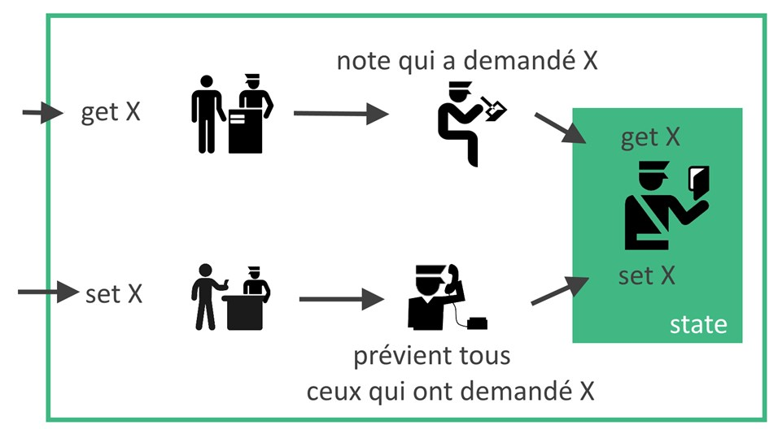

# Réactivité

La réactivité est le mécanisme qui permet au framework de détecter lorsque des données utilisées sur la page sont modifiées (_mutées_), et de mettre à jour la page de façon optimale. C'est donc une mécanique cruciale pour tout framework web, et il convient d'en analyser le fonctionnement pour comprendre ses forces et ses limites.

Vue fournit une réactivité automatique, c'est-à-dire qu'il n'est pas nécessaire au développeur de déclencher manuellement la mise à jour de la vue après avoir muté des données. Cette réactivité est basée sur une fonctionnalité de JavaScript : les **Proxies**

## Proxies (ECMAScript 6 alias ES2015)

```js
const original_user = { name: "joe" };
const user = new Proxy(original_user, {
  get(obj, key) {
    console.log(`accès en lecture à la propriété ${key}`);
    return Reflect.get(obj, key);
  },
  set(obj, key, value) {
    console.log(
      `accès en écriture à la propriété ${key} avec la valeur ${value}`
    );
    return Reflect.set(obj, key, value);
  },
});
```

Les Proxies sont une fonctionnalité assez récente de JavaScript apparue avec la spécification ES2015. Ils permettent de donner un contrôle complet sur toutes les opérations permettant de manipuler un objet. Vue s'en sert pour intercepter les accès en lecture et en écriture aux propriétés de vos vues, pour ainsi détecter les changements et mettre à jour les éléments concernés par ces changements.



## Détail du système de réactivité de Vue


