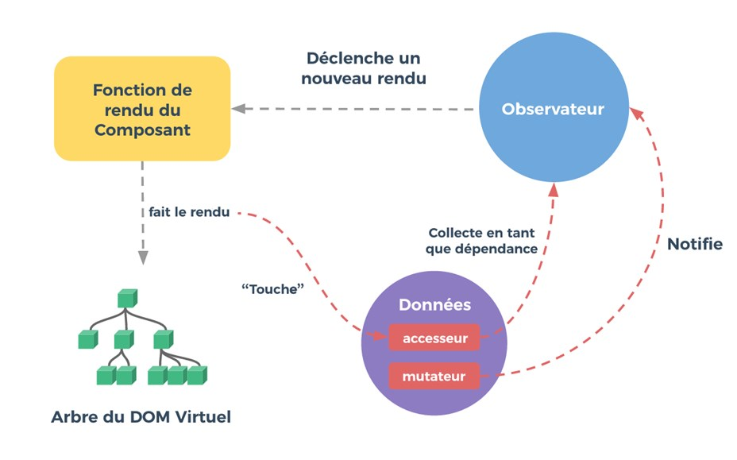

# Réactivité

La réactivité est le mécanisme qui permet au framework de détecter lorsque des données utilisées sur la page sont modifiées (_mutées_), et de mettre à jour la page de façon optimale. C'est donc une mécanique cruciale pour tout framework web, et il convient d'en analyser le fonctionnement pour comprendre ses forces et ses limites.

Vue fournit une réactivité automatique, c'est-à-dire qu'il n'est pas nécessaire au développeur de déclencher manuellement la mise à jour de la vue après avoir muté des données. Cette réactivité est basée sur 2 fonctionnalités de JavaScript : les **getters/setters** pour Vue 2 et les **Proxies** pour Vue 3

## Getters / setters (ECMAScript 5)

```js
let name = "joe";
const user = {
  get name() {
    console.log("accès en lecture à la propriété");
    return name;
  },
  set name(value) {
    console.log("accès en écriture à la propriété");
    name = value;
  },
};
```

En JavaScript, les propriétés d'un objet peuvent être déclarées avec un getter et un setter, qui sont des fonctions exécutées à l'accès en lecture et écriture à cette propriété. Vue.js les utilise en redéfinissant des getters/setters pour toutes les data et props des composants, de façon à identifier les consommateurs de ces données ainsi que le moment où celles-ci sont mises à jour.

La principale limitation des getters/setters est qu'il faut connaître au préalable le nom des variables pour leur assigner un getter/setter. C'est la raison pour laquelle **il est impératif de déclarer en data ou en props toutes les variables utilisées par un composant si on veut qu'elles soient réactives**.

Dans les cas particuliers où il n'est pas possible de déclarer une variable au préalable, comme par exemple un `Array` extensible de longueur indéfinie ou une `Map`, Vue propose la méthode `Vue.set` ou `vm.$set` pour assigner une valeur à une propriété en forçant la réactivité.


## Proxies (ECMAScript 6 alias ES2015)

```js
const original_user = { name: "joe" };
const user = new Proxy(original_user, {
  get(obj, key) {
    console.log(`accès en lecture à la propriété ${key}`);
    return Reflect.get(obj, key);
  },
  set(obj, key, value) {
    console.log(
      `accès en écriture à la propriété ${key} avec la valeur ${value}`
    );
    return Reflect.set(obj, key, value);
  },
});
```

Les Proxies sont une fonctionnalité récente de JavaScript apparue avec la spécification ES2015. Ils permettent de s'abstraire de toutes les limitations des getters/setters, en donnant un contrôle complet sur toutes les opérations permettant de manipuler un objet. Puisqu'ils ne sont pas supportés par les anciens navigateurs comme Internet Explorer, ils ne sont introduits totalement que dans Vue 3.0. Cela résout la plupart des limitations actuelles de la réactivité dans Vue 2, au prix de l'abandon du support d'Internet Explorer.

## Détail du système de réactivité de Vue


