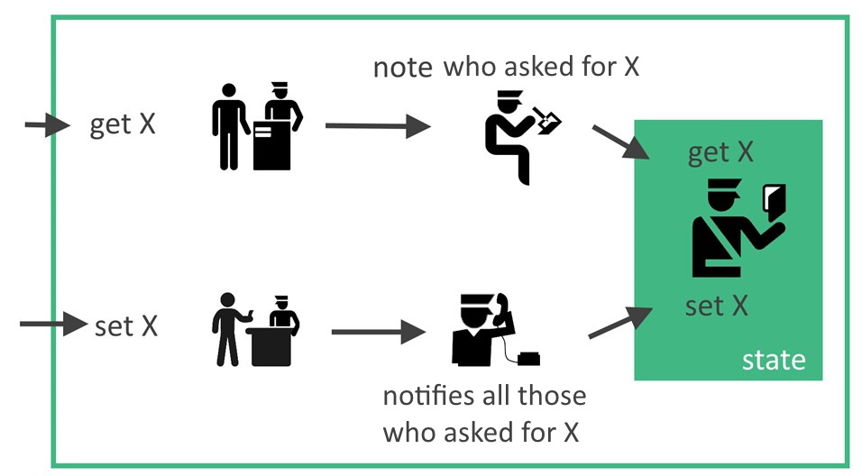

# Reactivity

Reactivity is the mechanism that allows the framework to detect when data used on the page is changed (_mutated_), and to update the page optimally to reflect these changes. It is therefore a crucial mechanism for any web framework, so we are going to analyze it to understand its strengths and limitations.

Vue provides automatic reactivity. That means it is not necessary for the developer to manually trigger the view updates after mutating data. This reactivity is based on a JavaScript feature: the **Proxies**.

## Proxies (ECMAScript 6 aka ES2015)

```js
const original_user = { name: "joe" };
const user = new Proxy(original_user, {
  get(obj, key) {
    console.log(`read access to property ${key}`);
    return Reflect.get(obj, key);
  },
  set(obj, key, value) {
    console.log(`write access to property ${key} with value ${value}`);
    return Reflect.set(obj, key, value);
  },
});
```

Proxies are a quite recent feature of JavaScript that appeared with the ES2015 specification. They allow you to get complete control over all operations used to manipulate an object. Vue use Proxies to intercept read and write access to properties of your views, to detect changes and update the elements concerned by these changes.



## Details of Vue reactivity system


